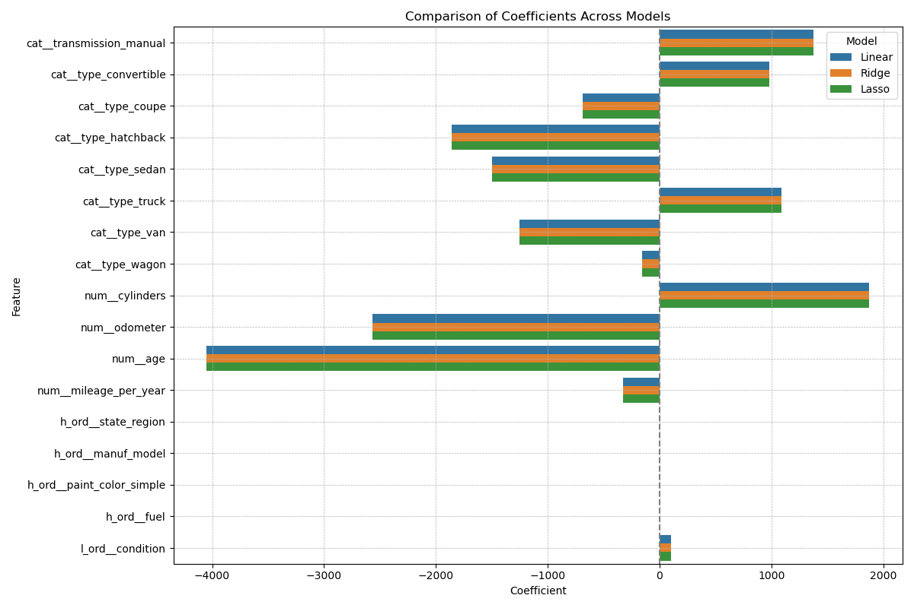

# UCB_AI-ML_11.1_What_Drives_Car_Prices

This repository contains:
- **prompt_II_DFant.ipynb**: Jupyter Notebook containing exploratory data analysis, feature engineering, model comparison, and tuning.
- **data/**: Folder containing the dataset used in this project. 
- **images/**: Folder with generated plots and visualizations.
  
---

## 📖 Project Overview

The objective of this project is to develop a data-driven multiple regression model to analyze the key factors influencing consumer demand as evidenced by used car prices and ultimately help the dealer stock and price inventory to maximize profitability. We will explore multiple supervised learning regression models. Explainability is a key requirement of the deliverable.  It is generally thought that age, mileage, and condition are key considerations - we want to confirm and identify any other important features through domain knowledge and statstical feature selection methods.  In addition, geographic variations will be explored to optimize pricing strategies for both local and broader markets as many consumers still like to buy locally but the rise in popularity of online listing sites expand consumers' geographical search area and options.

> **Note:** The dataset was filtered to include only **used, working, personal vehicles with clean titles** in **California**, removing new, offroad, salvage, and non-standard types. This ensures that our analysis reflects the market segment most relevant to everyday dealership operations in California. At scale we should be able to utilize the same analysis and process for other states.

---
## 🔍 Hypotheses

### **Primary Hypothesis**

> Used car prices are primarily influenced by a combination of **age**, **mileage**, and **condition**, which are commonly accepted as the key indicators of a vehicle’s value in the secondary market.

We expect:
- Newer cars with fewer miles to command **higher prices**.
- Vehicles in **excellent or good condition** to sell for more than those rated fair or poor.
- These relationships to be **consistent across most body types** and **regions** within California.

### **Supporting Hypothesis**

> Other vehicle attributes — such as **cylinders, transmission type, and body type** — provide additional predictive value and may explain pricing variation not captured by age or mileage alone.

Specifically, we expect:
- **Trucks and convertibles** to be priced higher than sedans and hatchbacks, even after adjusting for age and mileage.
- **Manual transmission** may contribute positively to price in certain vehicle segments, reflecting either enthusiast value or performance positioning.
- **Regional effects** may show up in subtle ways, given consumer preferences and inventory supply vary across counties and metros.

---

## ⚖️ Project Workflow

1. Business Understanding  
2. Data Understanding
   - Import Data and Basic Exploration 
   - Assess Data Quality 
   - Early Exploratory Data Analysis (EDA)    
4. Data Preparation
   -   Clean and Refine Features
   -   Impute Missing Data
   -   Filter Data to applicable subset
   -   Review Correlations and Check Multicollinearity 
5. Train/Test Split 
6. Modeling (Linear, Ridge, Lasso)  
7. Evaluation  
8. Deployment Key Findings and Recommendations  

---

## 🔹 Key Findings
**The strongest drivers of car price were:**

| Feature           |  Impact on Price |
|----------------------|-------------------|
| **Vehicle Age**       | Older cars sell for significantly less. |
| **Mileage (Odometer)** | More mileage = lower price. |
| **Engine Cylinders**   | Cars with more cylinders (e.g., V6, V8) command higher prices. |
| **Body Type**          | Trucks and convertibles are priced higher than hatchbacks and vans. |
| **Transmission Type**  | Manual transmission is positively associated with price (may reflect performance/niche appeal). |

Features such as fuel type, paint color, and model name were also included in the analysis, but had relatively minor influence on price.

---

---

## 📊 Model Summary

I compared three models:
- `LinearRegression`
- `Ridge Regression` (L2 regularization)
- `Lasso Regression` (L1 regularization)

All achieved strong performance:

| Model              | RMSE      | MAE       | R² Score |
|-------------------|-----------|-----------|----------|
| Linear Regression | $6,135.70 | $4,137.15 | 0.77     |
| Ridge Regression  | $6,135.70 | $4,137.15 | 0.77     |
| Lasso Regression  | $6,135.71 | $4,137.15 | 0.77     |

> The small difference between models indicates minimal multicollinearity and good data conditioning.

---

## ✅ Hypotheses Review

### **Primary Hypothesis Review**
> *Used car prices are primarily influenced by a combination of age, mileage, and condition.*

✅ **Supported.**

- **Age** and **odometer readings** were the two most negatively correlated features with price across all models.
- All three regression models confirmed that as age and mileage increase, vehicle prices decrease substantially.
- **Condition** showed a moderate, but consistent, positive relationship with price — vehicles rated as “excellent” or “good” fetched higher average prices.

These results confirm that the traditional wisdom about used car valuation holds true in a data-driven analysis.

---

### **Supporting Hypothesis Review**
> *Other features (e.g., body type, transmission, and engine specs) offer additional predictive value beyond age and mileage.*

✅ **Partially Supported.**

- **Body type** mattered — convertibles and trucks were consistently priced higher than vans and hatchbacks, even after controlling for other factors.
- **Transmission type** (specifically manual) was positively associated with price in some segments, though its overall impact was smaller than expected.
- **Cylinders** had a measurable, positive effect — vehicles with more powerful engines tended to be priced higher.
- However, **fuel type, paint color**, and **model name** were found to have low predictive value in this analysis.

While these features added some value, they were secondary to core metrics like age and mileage. Regional analysis is still underway and presents an opportunity for further refinement.

---

## 💡 Recommendations

- **Prioritize sourcing trucks, convertibles, and vehicles with higher cylinder counts**, especially when they are relatively low-mileage and under 10 years old.
- **Depreciation accelerates with age and mileage**. Consider offering promotions to move older, high-mileage inventory faster.
- **Transmissions matter**: Manual transmissions may signal niche or enthusiast value — consider when pricing or highlighting.
- **Condition matters** — but customer perception seems to be shaped more by mechanical specs than cosmetic ones.

---

## 🚀 Next Steps

Future versions of this work could:
- Include **regional submodels** or **dealer-specific pricing strategies**
- Explore **tree-based or ensemble models** (e.g., Random Forest, XGBoost)
- Extend to other states - consider adding an input for state in the filter.

---
